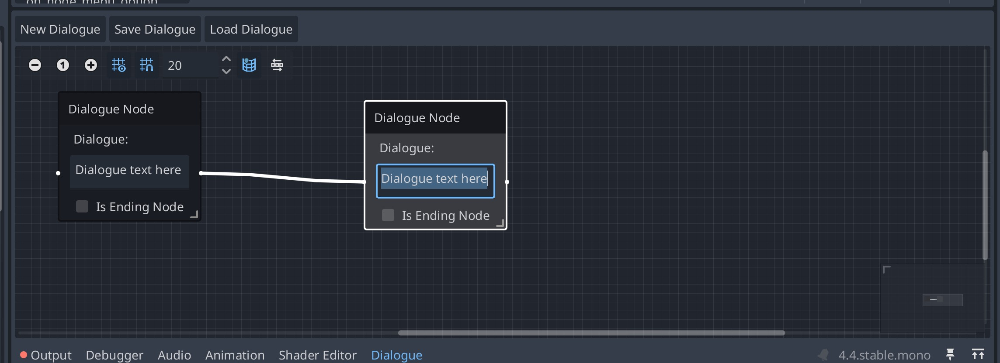

+++
date = '2025-05-14T17:21:41-04:00'
draft = false 
title = 'Dialogue System Part One'
+++

Something I've been thinking about and working on is a node-based dialogue system.

I've just begun writing my own isometric, story-driven RPG, and found that managing 
and writing dialogue to be a bigger challenge than anticipated. 

There's [plenty](https://github.com/nathanhoad/godot_dialogue_manager) of solutions out there for Godot, 
but writing my own just sounded plain _fun_.

After some tinkering with Godot and a lot of misses with inspectors and exported
variables deeply nested, I discovered [GraphEdit](https://docs.godotengine.org/en/stable/classes/class_graphedit.html).
The docs _do_ say that it is experimental, but it seems to contain a lot of 
the things I want. 

With GraphEdit in mind, I mocked up a design of what I wanted, and found it fairly straightforward.

I'm not overly concerned with managing game state flags within the system - the 
controller code can handle that. Each 'dialogue instance' will receive it's own
`DialogueManager` object that handles loaded the resources generated by the 
tool, and the inputs/outputs will allow management of game state. This part 
is tricky and not something I've fully fleshed out yet.

Anyway, after some tinkering, I came up with a basic UI. It still needs 'choice' containers within
the node, but I found it absolutely wonderful that I could get a mocked-up front-end done in an afternoon
in about 300 lines of code.

